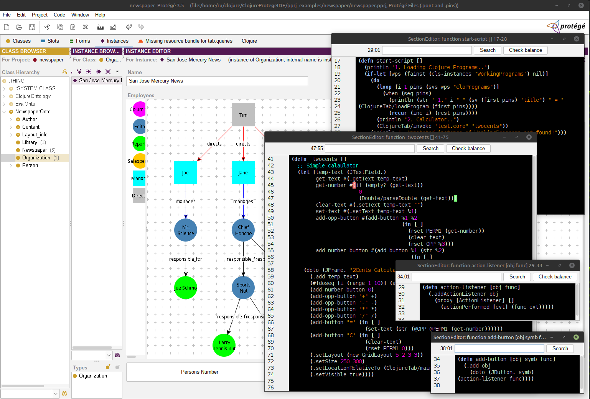

# ClojureProtegeIDE
Further development of the [ClojureMiniIDE](https://github.com/rururu/ClojureMiniIDE) project 
based on the [Protege 3.5](https://protege.stanford.edu/download/protege/3.5/installanywhere/Web_Installers/) ontology editor



## Special Features

1. **Representing knowledge as ontologies**
Using an ontology editor Protege 3.5to represent a subject area (frame data model) in object-orientet form.

2. **Program.** 
In Clojure, there's no concept of a "program"; there's only the concept of a "namespace". 
These aren't quite the same thing. A given task typically requires multiple namespaces. 
ClojureMiniIDE defines a *program* as an ordered sequence of namespaces. 
The order is determined by the order in which namespaces must be loaded, 
as this is essential for program operation. 
A special button is available for automatically loading a program.

3. **Separate windows for functions and other program elements.** 
This allows you to simultaneously edit multiple functions on the screen, from different namespaces, 
and only those needed at the moment. The automatic loading button simultaneously 
composes ("builds") various namespaces from all open and possibly modified elements, 
saves them, and loads them in the desired order.


## Usage

```shell
$ cd <some root folder>
$ ./run.sh       # Linux, MacOS
$ run.bat        # Windows
```

## Video Lessons

[Lesson 1. Creating a new project](https://www.youtube.com/watch?v=aPok0dUj3_k)

[Lesson 2. Adding Clojure Functionality](https://www.youtube.com/watch?v=CWE0oZxnYTM)

## License

Copyright © 2026 Ruslan Sorokin

Distributed under the Eclipse Public License either version 1.0 or (at
your option) any later version.
